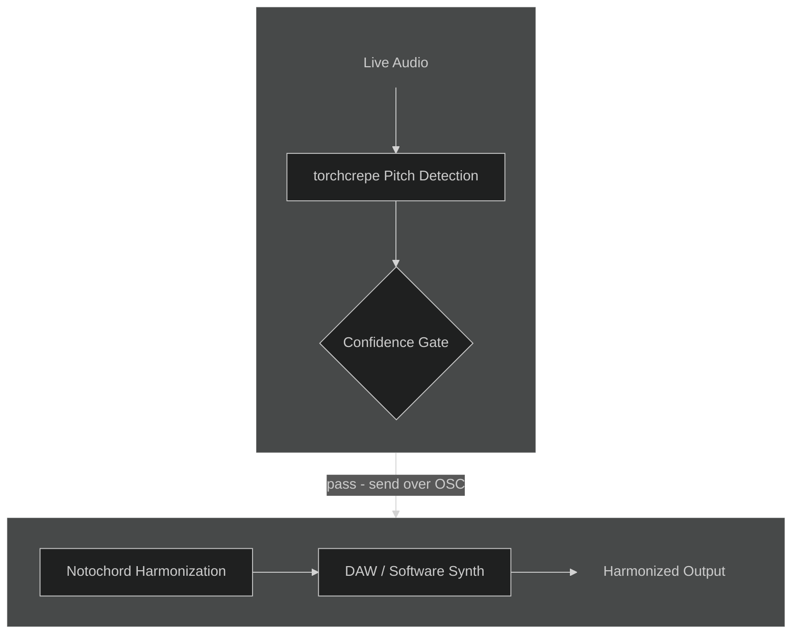
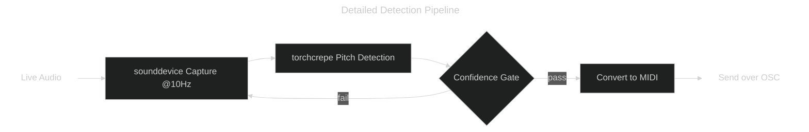

# Live Acoustic Neural Harmonizer

    <small>Built for CS352: Machine Perception of Audio @ Northwestern University</small>
     
    <small>Guided by Annie Chu</small>

<a class="link-button" href="https://github.com/ryanrlee/live-harmonizer" target="_blank" rel="noopener noreferrer">View GitHub Repo</a>

When creating musical ideas, it is often hard to concepualize the full scope of harmonies and rhythms when working alone. Having new background ideas availble in real-time greatly expands the freedom and flexibility musicians have when demoing and/or tinkering with ideas, even with just a single instrument or voice. This project aims to create a real-time system that can take a live audio signal from any instrument and generate real-time harmonies through MIDI.

## Demo

## System Pipeline

The harmonizer system is built with Python and consists of two main sections centered around the torchcrepe & Notochord models, which handle the audio detection and harmonization, respectively. 

torchcrepe is a Pytorch impelemntation of the CREPE pitch tracker, a CNN-based neural network that operates directly on the input waveform. Audio from the device microphone is fed into this model every 100ms through the sounddevice Python library. torchcrepe returns a detected pitch in hertz, which is then converted to MIDI notation. It also returns a confidence metric, which allows for the detected pitch to be sent to Notochord only when the model is confident a pitch is being played. The transfer of the MIDI data is done through OSC.

Notochord is a real-time neural network model for MIDI performances developed by the Intelligent Instruments Lab. It was designed utilizing autoregression and probabilistic formulations to allow for extreme low-latency performance usage. The MIDI data recieved from torchcrepe is run through this predictive model to determine a harmonized note. The model outputs the MIDI representation of its predicted note, which is then routed through to a DAW/software synthesize to be played aloud.

## Latency?

Latency was one of the main focuses in trying to get this system to work for live performance. Luckily, both torchcrepe and Notochord are designed to work live, with the former having a "tiny" model for real-time processing and the latter being built for musical performing. The total latency for the system sits at ~100ms, in addition to accouting for the sample rate of the sounddevice capture currently set at 10Hz (every 100ms). 

Surprisingly, the Notochord latency is the lowest at ~15ms, with torchcrepe at ~42ms & OSC at ~47ms. With the communication protocol being the largest bottleneck, an improvement in latency is very achievable just by altering the component structure.

## Testing Harmonization

Notochord works as a predictive model, indicating that it will make more informed harmonical decisions the longer it is running. Currently, I am running the model in its purest form, where it takes a generates a single predicted harmony note from a MIDI note-on input. Here is a demo of this in action focused around the melody of "Mary Had a Little Lamb".

As evident in the video, the harmonization gradually becomes more tonal and standardized to what we would expect the chord outline to be from a Western musical perspective. There are many more parameters and variations on Notochord to try and tweak, which is a goal for the near future.

## Musician's POV

As a percussionist and overall musician, I chose this project route as I love discovering new technologies to enhance live performance. In its current interation, however, it has its shortcomings when trying to utilize it with real, live music. The latency is a bit too much to be useful for anything other than slow chorales and the harmonization is oftentimes seemingly random and nonsensical. Despite this, I believe that this idea still has some life in terms of live peformance, as these two main issues can easily be tinkered and resolved, as explained in the earlier sections. 

## Future Improvements

Below is just a short list of features that can continue to make this project better. Most of these have already been outlined above, but I have listed them here for documentation purposes.

- Improve communication protocol for lower latency
- Tweak/retrain parameters for better Notochord output
- Refine input sensitivity in sounddevice/torchcrepe
- Reduce feedback from own output
- Potential development to allow for live adjustment of harmonization style

